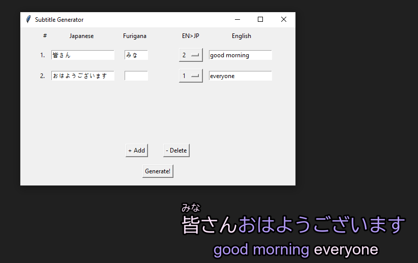

# Japanese Furigana Text Generator

Converts Japanese text input, it's reading, and it's english translation
into a nice looking block output block for language learning subtitles or 
other uses.

the `EN>JP` dropdown links the coloring of the English and Japanese
sections, this should line up with the index number on the far left.

The main program is the file `gui_controller.py`, or download from the
[release page](https://github.com/TotalHelix/subtitle_maker/releases).